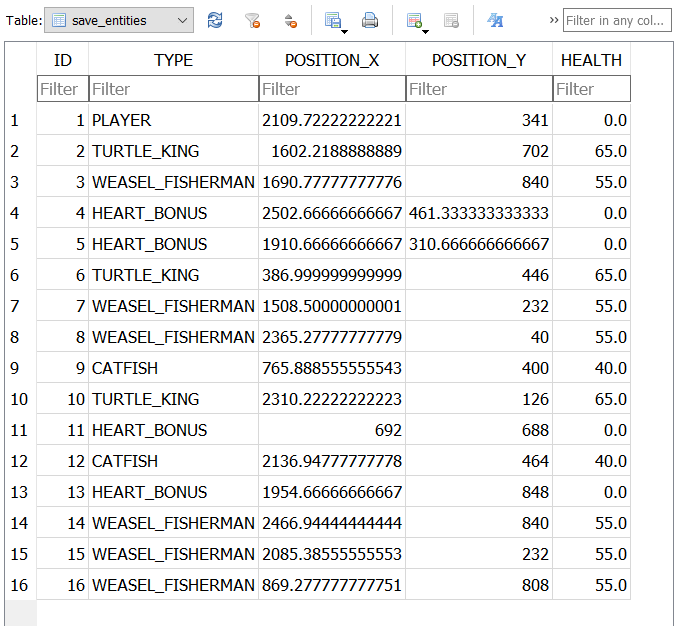

# Description
This is a 2D platformer game made in Java using Java AWT Graphics. The game is designed mainly on an Entity Component System(ECS) 
and is using a SQLite database for saving the scores and game level state.

# Game story

The main character, Ignacio, couldn't bear the city's crowdedness anymore and decided to move to the countryside.
He had a piece of land inherited from his grandfather in a village called Ciudățeni, where he began to cultivate plants. 
The locals say that the name of the village comes from the fact that in the past, there was a satanic altar there, which
caused strange things to happen ever since.

After a hard day, Nacio goes to greet his animals, intending to go to bed, but when he arrives, they have disappeared.
After long searches, he gives up and goes to bed. When he gets home, he falls into a deep sleep, but the peace doesn't 
last long, the farmer entering a deep dream.

Ignacio suddenly lands in a fabulous world, but is surprised to find that he is no longer dressed in his farmer's clothes,
but in the attire of Indiana Jones. He had to climb and make leaps at the edge, finally reaching an endless abyss. With
no way back, he jumps into it.

He wakes up in a cave full of platforms, rickety stairs, spikes, and lava. When he looks around, he finds a lasso beside
him. After traversing this, he reaches a door, believing it to be his escape, but this door leads to another cave. The 
cave is full of enemies, and he uses the lasso to defeat them. After killing the creatures, the door unlocks. On the other
side of the door, he finds an old man who tells him that he is trapped in his own dream and that he must pass through all
the creatures and all the levels to find his animals.

The last open door leads the farmer into a familiar world where there is a pen, and he finds his animals. After he feeds
them, he wakes up from the dream. Upon waking, he rushes to the farm but notices that everything is normal, untouched.

Now, Ignacio, filled with confusion, wonders: "Was the whole day yesterday a dream, was the dream real, or am I really 
trapped in a continuous dream?"

# How to play
Clone the repository and run the project.
## Controls
- `A` -> Move left
- `D` -> Move right
- `Space` -> Jump
- `F` -> Attack
- `W` -> Climb ladder

# Architectural Design
The game architecture revolves around the Entity Component System (ECS), with entities serving as the central building blocks.
Entities are essentially empty objects to which components are added to form complete objects. To streamline development,
entities are structured hierarchically, inheriting from a base Object class and extending it with necessary components.
These objects are organized within scenes, forming the foundation of the game's scene system. Scenes are managed using a 
stack-based approach, with the active scene residing at the top of the stack (for example, the pause menu scene takes 
precedence over the game scene when opened).  

Animation is handled through state machines, where each animation represents a state, and transitions are triggered by 
specific keys. Sprites represent individual frames of animation, collectively forming dynamic sequences. Keyboard and
mouse input are managed using the observer pattern, with components subscribing to a global listener. When an event occurs,
all subscribed components are notified accordingly.  

To facilitate saving and restoring game states, the memento pattern is employed, allowing for seamless state management 
at any point in the game.  

## Entity Component System(ECS)

The game is based on an Entity Component System (ECS) architecture, representing an architectural design pattern. 
With its help, you can build components as general as possible that can be used for any type of component object in the game.
GameObject contains a list of components to which you can add using the addComponent method. To obtain a reference to an 
object's component, we use the getComponent method, which takes a Template bounded superior to the Component class as a 
parameter. The object contains functions such as init, update, and draw, which call each component that implements these
functions to operate the object's components.

## Components

Here are all the components used in creating objects:

- **PositionComponent**: This is the most important as it contains the object's position and the velocity vector, which
- helps in the object's progressive movement using the sign vector that indicates the direction in which the object should move.

- **SpriteComponent**: Handles rendering the image representing the object on the screen.

- **AnimationStateMachine**: Represents a state machine for the object's animations. Using the trigger function, we can
- induce another animation state for the object stored through AnimationState.

- **KeyboardControllerComponent**: This is an observer that subscribes to an observable for the keyboard, which signals
- when a keyboard-related event occurs, and it handles how to treat this event. It stores the state of the keys under 
- the type of KeyState and transmits this to the MovementMediator.

- **ColliderComponent**: Represents the object's colliders that will be checked for various collisions of the object. 
- Colliders are stored in the form of a Rectangle.

- **DynamicCollisionComponent**: This class checks collisions for moving objects by setting some flags specifying which
- corner the collision is in, storing the type of the collider, of type ColliderType.

- **MovementMediator**: Represents a mediator for the entity's movement, mediating conflicts and dependencies. It
- handles resolving collisions of the object with map tiles or objects such as stairs. It also deals with the interaction
- with KeyboardControllerComponent by implementing methods for jumping, climbing stairs, and attacking the object.
- We chose to use the mediator, being a behavioral design pattern, to separate dependencies between components.

- **AttackComponent**: Used for both players and enemies when the entity needs to attack. It handles adding the attack 
- collider and the enemy's attack.

- **AiBehaviour**: Handles the movement of enemies, tracking the player, and attacking when in the attack range.

- **TextComponent**: Responsible for displaying text on the screen.

## Scenes

The game is based on a scene system, storing active scenes as a stack and operating on the top scene of the stack. 
The game contains scenes such as: the gameplay level, the main game menu, the menu displaying the best score, the game 
over menu, and the pause menu. The game will update and display only the entities in the current scene, which brings an 
advantage in performance and ease of scene switching in use.

## Factory

The factory is used to create objects in the game using an interface. The factory created using this interface is the 
entity factory through which we can create the player and any type of enemy, just by specifying the entity type obtained
through EntityType that implements the FactoryTypes interface, and the coordinates at which the entity should be created.
The factory can also create buttons or bonuses.

## Entity

Entities are created through this hierarchy starting from Object, which extends GameObject. Entity offers the possibility
to create any type of object, and from here, enemies are formed in a general sense, as well as the player, and various
types of enemies can be formed from enemies. Tile represents the objects that make up the level map. All objects encapsulate
their creation using components.

## Sprites

Here is represented everything related to loading sprites and animations for entities. All of this is done from a JSON file,
both for the map by loading the locations and tiles on the map, as well as the starting position of the player and enemies.
The animations are also loaded from a JSON file, loading each animation based on an ID representing the states in the animation
state machine.

# Design Patterns

## Builder

The builder is used to create different types of buttons for the game menu. The builder contains all the properties that
can be added to the button. The BuilderDirector contains details for different types of buttons, and by providing it with
a BuilderTypeEnum, it creates the desired button using the builder.

## Memento

Memento is used to save the current state of the game in a Memento, and then the state can be restored if desired. 
This memento can be saved in the database from where it can be loaded later.

## Observer

The Observer is used for both the keyboard and mouse. Objects subscribed to the observable will be notified when an 
event occurs, and they will handle this event.

## Factory

Factory is used to create objects in the game, buttons, and scenes. The necessary implementation of the factory interface 
is chosen, and the desired type of object to be created is provided.

## State Machine

The state machine is used for handling the animations from the game. Every animation is a state in the state machine 
and from each state with a specific trigger key, we can go to another state, so another animation. It is used for the 
player and the enemies animation but also for buttons, doors. 
  
The enemy's AI behavior state machine

# Database

The game uses a SQLite database to store the best score and the state of the game. The database contains two tables:
- **save_entities**: Contains the state of the game, such as the entity type, it's position and the health status

- **high_score**: Contains the best score for each level

# Game screenshots
### Game main menu 
 
### Game level 1 
 
 
### Game level 2 
 
### Game level 3 
 

# Assets references

- Stardew Valley, Eric "ConcernedApe" Barone, www.spriters-resource.com/pc_computer/stardewvalley
- Old man with a Big bag, Moustikouille, moustikouille.itch.io/old-man-with-a-bigbag
- Treasure Hunters, Pixel Frog, pixelfrog-assets.itch.io/treasure-hunters
- Stringstar Fields, Trixelized, trixelized.itch.io/starstring-fields
- Monsters Creatures Fantasy, Luizmelo, luizmelo.itch.io/monsters-creaturesfantasy
- Cavernas, Adamatomic, adamatomic.itch.io/cavernas
- Medieval pixel art asset, BlackSpireStudio, blackspirestudio.itch.io/medievalpixel-art-asset-free
- Inca Game Assets, Kronbits, kronbits.itch.io/inca-game-assets
- Micro Fantasy, 0x72, 0x72.itch.io/microfantasy
- Monster Pack I, Penusbmic, penusbmic.itch.io/monster-pack-i
- Pico8 Pixel Art, S4m Ur4i, s4m-ur4i.itch.io/pico-8-pixelart-free-tiles
- Adve, Egordorichev, egordorichev.itch.io/adve
- Critters Enemy Pack 3Foozlecc, foozlecc.itch.io/critters-enemy-pack-3
- Pixel Art Adventure Pack, The Baldur, the-baldur.itch.io/pixelart-adventure-pack
- Kings and pigs, Pixel Frog, pixelfrog-assets.itch.io/kings-and-pigs
- Retro Pixel Art, S5m Ur4i, s4m-ur4i.itch.io/free-sprites-elements-8x8-retropixelart-platformer-brawler